# NFL Combine 40-Yard Dash — Movement Time Series

[](https://colab.research.google.com/github/phcs971/nfl-combine-40-timeseries/blob/main/notebooks/quickstart.ipynb)


[](https://doi.org/10.5281/zenodo.22983135)

Per-frame multivariate time series of every 40-yard dash in the 2026 NFL Scouting
Combine broadcasts, labelled with one of three position classes, for time-series
classification.

Each run gives, at 29.97 Hz:
- position along the lane, velocity and acceleration;
- pose channels: trunk lean, hip height, joint angles, stride;
- the unofficial 40-yard time shown on screen.

Every series spans the on-screen clock, from the frame just before it starts to the
frame just after it stops.

- 11 NFL YouTube videos → 326 runs detected → **276 kept** (164 athletes). 48 were
  rejected by quality control and 2 excluded (a QB).
- At least 24 athletes per class on each side of the train/test split.
- Every value is measured from the video pixels. Distances are calibrated on the
  field's painted yard lines, which agree with our marks to a median 0.16 yd.

| | |
|---|---|
| Download | [Getting the data](#getting-the-data) · [Colab quick start](notebooks/quickstart.ipynb) |
| Documentation | [Datasheet](DATASHEET.md) · [Data dictionary](datapackage.json) · [Changelog](CHANGELOG.md) |
| Method | [How the dataset was generated](#how-the-dataset-was-generated) · [Validation](#validation) |
| Legal | [Licence](#licence) · [Ethics and legal notes](#ethics-and-legal-notes) · [How to cite](#how-to-cite) |

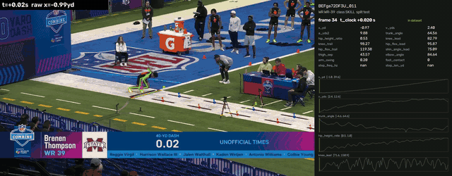

## Classes

| Class | Positions | Source videos (`data/videos.csv`) |
|---|---|---|
| `SKILL` | WR, CB, SAF | WR group 1 `0r_usy_GIAI`, WR group 2 `BEFga72DF3U`, DB `-zgIolzsJxY`, safeties `UcatZ1FYe5E` |
| `STRONG` | RB, TE, LB, EDGE | RB `g__zmhX838U`, TE `9xc35LbeeUE`, LB `olzS7RidilY`, EDGE `LDqozfzjaNU` |
| `LINEMAN` | OL (OT, G, C), DT | OL group 1 `W23Nvg3rw6U`, OL group 2 `f9RAoGpGkIY`, DL `Sr-Q6UjJq6g` |

The class comes from the session video. QBs and specialists are out of scope. The
position code on the broadcast panel is read on every run, and one QB who ran inside
the WR group 2 session is excluded.

## Getting the data

The repository is public, so every file can be read straight from GitHub. No clone
or account is needed.

```python
import pandas as pd

VERSION = "main"  # or a release tag, e.g. "v1.0.1", to pin the data
BASE = f"https://raw.githubusercontent.com/phcs971/nfl-combine-40-timeseries/{VERSION}/data"

runs = pd.read_csv(f"{BASE}/runs.csv")                             # one row per run
series = pd.read_parquet(f"{BASE}/series.parquet")                 # one row per video frame
by_time = pd.read_parquet(f"{BASE}/series_by_time.parquet")        # 101 points per run
by_distance = pd.read_parquet(f"{BASE}/series_by_distance.parquet")  # every 0.25 yd, 0–39 yd

runs = runs[runs.status == "ok"]
```

- **Google Colab.** Open the [quick-start notebook](https://colab.research.google.com/github/phcs971/nfl-combine-40-timeseries/blob/main/notebooks/quickstart.ipynb).
  It loads the files as above, plots a run and the class medians, saves local
  copies, and trains a logistic-regression baseline (0.76 test accuracy on three
  channels).
- **Command line.** `curl -O <BASE>/series.parquet` for single files, or
  `git clone https://github.com/phcs971/nfl-combine-40-timeseries` for everything.
  GitHub's *Code → Download ZIP* also works.
- **Pinning a version.** For a paper, load from a release tag rather than `main`.
  The files at a tag never change. Checksums of every file are in
  [`datapackage.json`](datapackage.json).

## Dataset

### Counts

| Class | Athletes | Train: runs / athletes | Test: runs / athletes |
|---|---|---|---|
| `SKILL` | 61 | 55 / 31 | 55 / 30 |
| `STRONG` | 54 | 43 / 27 | 46 / 27 |
| `LINEMAN` | 49 | 38 / 25 | 39 / 24 |

Kept runs by position: WR 50, CB 38, SAF 22, RB 15, TE 32, LB 18, EDGE 24, OL 56,
DT 21. Most athletes run twice. The split is by athlete, so both attempts land on the
same side. It is stratified by position within each class and seeded
(`build_db.py`, `SEED = 2026`).

Unofficial 40-yard times (`time_40yd`, mean ± sd): SKILL 4.45 ± 0.09 s,
STRONG 4.62 ± 0.12 s, LINEMAN 5.10 ± 0.14 s.

### Files

All series cover the clock window plus one frame either side.

| File | One row per | Contents |
|---|---|---|
| `data/runs.csv` | detected run (326) | identity, class, split, `time_40yd`, `time_10yd`, QC metrics, `status` |
| `data/series.parquet` (+ `series.csv`) | video frame of a kept run (39k rows, 130–164 per run) | every channel on every frame |
| `data/series_by_time.parquet` | 1% step of a kept run (101 per run) | the clock window resampled from `phase` 0 (start) to 1 (stop) |
| `data/series_by_distance.parquet` | 0.25-yd step of a kept run (157 per run) | the channels at each distance from 0 to 39 yd, with `t_clock` at each |
| `data/videos.csv` | source video (11) | title, channel, upload date, URL, and the SHA-256 of the analysed file |
| `data/runs_raw.csv`, `data/panel_positions.csv` | detected run | intermediate outputs of the clock scan and position-code reader |
| `data/templates/*.json` | – | labels for rebuilding the panel-reading templates |
| `datapackage.json` | – | data dictionary: every column's type, unit and description; file sizes and SHA-256 |

About the resampled files:
- **`series_by_time`** is the equal-length view most classifiers need.
- **`series_by_distance`** aligns runs by position on the field. It starts at the
  start line, which the hip reaches ~0.3 s after the clock starts. It ends at 39 yd
  because the clock stops when any part of the athlete breaks the beam, while the hip
  is still ~0.4 yd short of 40. 275 of 276 runs span the full grid.
- **Neither is extrapolated.** Stride channels stay empty before the first stride.
  `foot_contact` is resampled by nearest frame.

### Example: one run, per frame

`BEFga72DF3U_011`, a wide receiver (`WR-39`), test split, `time_40yd` 4.26 s:

| t_clock | x_yd | v_yds | a_yds2 | trunk_angle | hip_height_ratio | knee_lead | foot_contact | step_len_yd |
|---|---|---|---|---|---|---|---|---|
| −0.01 | −1.05 | 1.97 | 9.8 | 80.4 | 0.58 | 109.6 | 1 | – |
| 0.02 | −0.97 | 2.40 | 9.9 | 64.6 | 0.53 | 82.8 | 0 | – |
| 0.49 | 0.99 | 5.99 | 4.9 | 35.2 | 0.67 | 123.2 | 0 | 1.11 |
| 1.65 | 10.06 | 8.98 | 2.6 | 17.5 | 0.78 | 142.4 | 1 | 1.43 |
| 2.99 | 23.90 | 11.44 | 3.3 | 14.0 | 0.91 | 127.3 | 0 | 2.26 |
| 4.26 | 39.21 | 10.79 | −11.4 | 24.1 | 1.02 | 85.2 | 0 | – |
| 4.29 | 39.55 | 10.11 | −12.8 | 25.6 | 1.01 | 109.3 | 0 | – |

- **First and last rows:** the bracketing frames either side of the clock.
- **The start:** the clock starts on first movement. The hip is still 1 yd behind the
  start line, low (0.53 of leg length), with the trunk at 65°.
- **The run:** by 10 yd the athlete runs at 9 yd/s with 17° of lean. By the stop they
  are upright at about 11 yd/s.

### Channels

Every channel is computed on every frame. Pose channels are dimensionless (degrees
or ratios), so absolute body size is not encoded.

| Channel | Unit | Meaning |
|---|---|---|
| `frame`, `t_clock` | –, s | clip frame index; time on the broadcast clock |
| `phase` | – | `series_by_time` only: 0 at the clock start, 1 at the stop |
| `x_yd` | yd | position along the lane of the ground point under the hip, from the start line |
| `v_yds`, `a_yds2` | yd/s, yd/s² | velocity and acceleration, Savitzky–Golay derivatives of `x_yd` |
| `trunk_angle` | deg | shoulder-mid → hip-mid vs vertical, positive leaning forward |
| `hip_height_ratio` | – | hip height above the ground / leg length |
| `knee_lead`, `knee_trail` | deg | knee angle of the forward / rear leg (180 = straight) |
| `hip_flex_lead`, `hip_flex_trail` | deg | trunk–thigh angle per leg |
| `shin_angle_lead` | deg | forward leg's shin vs vertical |
| `thigh_sep` | deg | angle between the thighs |
| `elbow_angle` | deg | mean elbow angle |
| `arm_swing` | – | fore–aft spread of the wrists / arm length |
| `foot_contact` | 0/1 | a foot is planted (ankle stationary along the lane) |
| `step_freq_hz`, `step_len_yd` | Hz, yd | from successive touchdowns after the clock starts, held until the next one |
| `valid` | 0/1 | position and the core pose channels are all measured |

Legs are labelled lead/trail by position along the lane rather than left/right. The
pose model swaps sides when the legs cross in a side view.

### `runs.csv` columns

| Group | Columns |
|---|---|
| Identity | `run_id`, `video_id`, `group`, `position`, `panel_pos`, `cls`, `athlete` (`<panel code>-<bib>`), `bib`, `attempt`, `split` |
| Outcome | `status` (`ok` / `rejected` / `excluded` / `duplicate`), `qc_reason` |
| Times | `time_40yd` (unofficial on-screen time when the clock stops), `time_10yd` (panel 10-yd split, line groups) |
| Clock fit | `k0` (clip frame where the clock reads 0), `clip_ss`, `clip_frames`, `clock_resid_p95`, `clock_coverage` |
| Measured checks | `t_at_10yd` (hip crosses 10 yd), `x_at_zero`, `x_at_stop` (hip at the clock start / stop), `yardline_resid` |
| QC metrics | `bib_agree`, `panel_min_corr`, `max_cut`, `turf_min`, `turf_median`, `lane_frac`, `track_frac`, `start_support`, `max_step_yd` |

Every column is described, with units, in [`datapackage.json`](datapackage.json).

## How the dataset was generated

> Broadcast frames and GIFs in this section are © NFL (NFL YouTube channel). They
> are reproduced at reduced resolution to illustrate the method, and are not covered
> by the data licence.

### 1. Source videos

The NFL published one YouTube video per position-group session of the 2026 combine
40-yard dash: 11 videos, uploaded between 2026-02-26 and 2026-03-01.

`src/download.py` fetches them at 1080p, 29.97 fps. `data/videos.csv` records each
video's title, upload date and the SHA-256 of the exact file analysed. The
broadcast shows two things the whole method relies on:
- a lower-third panel with the athlete, position code, bib and a live clock;
- a lane marked with two rows of black dashes, filmed by a camera that pans with the
  runner.

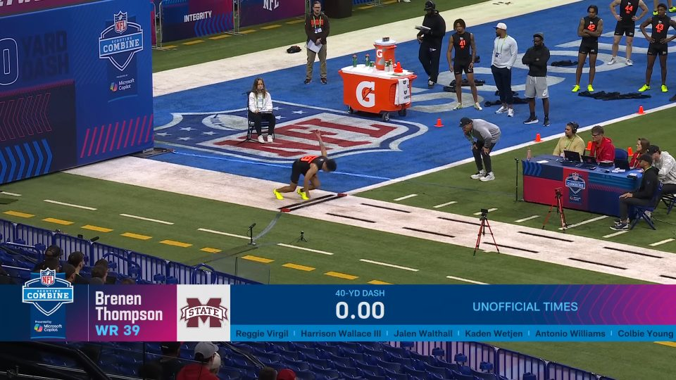

### 2. Reading the clock

The panel clock (0.01 s) is read by template matching (`src/panel.py`).
- **Templates.** Digit shapes are harvested from the feed, clustered, and each
  cluster is labelled by eye once. Only the labels are committed
  (`data/templates/`).
- **Reading.** A time is accepted only as `d.dd` with its decimal point.
- **Bib.** The bib number is read the same way.

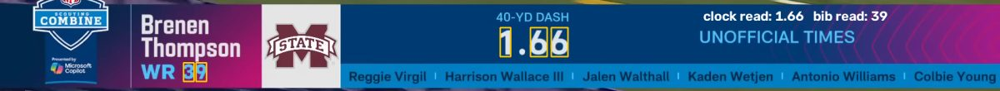

**Finding runs** (`src/segment.py`). A 4 fps scan of each whole video finds every
stretch where one field counts up at real-time rate and then freezes. That frozen
value is the run's `time_40yd`.
- **Field positions.** They are grouped by position on screen, so a field's centre
  can jitter by a few pixels with its digits.
- **Layouts.** Groups differ: `40-YD DASH`, `1ST RUN / 2ND RUN`, or
  `10-YD SPLIT / 40-YD DASH`. The live field is whichever one changes.
- **The 10-yd split.** It doesn't count live: its slot holds 0.00, then shows the
  split (`time_10yd`).

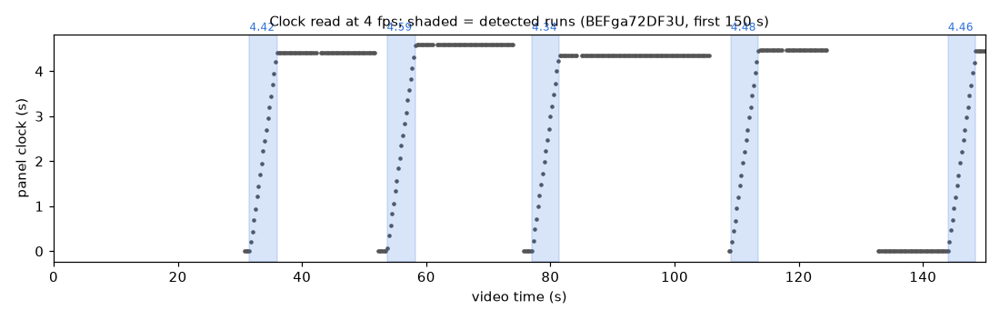

**Frame-accurate zero.** Every frame of the run is then read. The clock zero `k0` is
fitted to a fraction of a frame, with `t_clock = (frame − k0) / 29.97`. The slope is
fixed by the frame rate, and the median over the run is immune to the odd misread.
The p95 residual is ~0.012 s, which is the graphic's own render jitter.

### 3. Who is running

- **Athlete key.** The bib is majority-voted over the run. The key is
  `<position code>-<bib>`; bibs are unique within a position group.
- **Position code.** The code (`WR`, `DB`, `QB`, …) is matched against labelled
  patches (`src/positions.py`). A run whose code isn't the session's group is
  excluded.
- **Duplicates.** The same athlete and time in a second upload would be a seam
  duplicate; none occurred. Two attempts with identical times do happen and are
  kept, since their footage differs.

### 4. The lane: dash rows, yard lines, start line

On every frame (`src/lane.py`):
- **Dashes.** Dark elongated blobs surrounded by white lane. Two RANSAC lines split
  them into the near (red) and far (blue) rows.
- **Per-frame fit.** Each row's dashes are indexed along the row, and an exact 1-D
  perspective map from index to image position is fitted. Equally spaced points on a
  line obey this map exactly.
- **Yard lines (cyan).** The field's painted yard lines are found as long white
  lines crossing the lane.
- **Start line (orange).** It is taken as the cross-lane mark under the runner's
  hands at the clock start. It sits on a painted yard line.

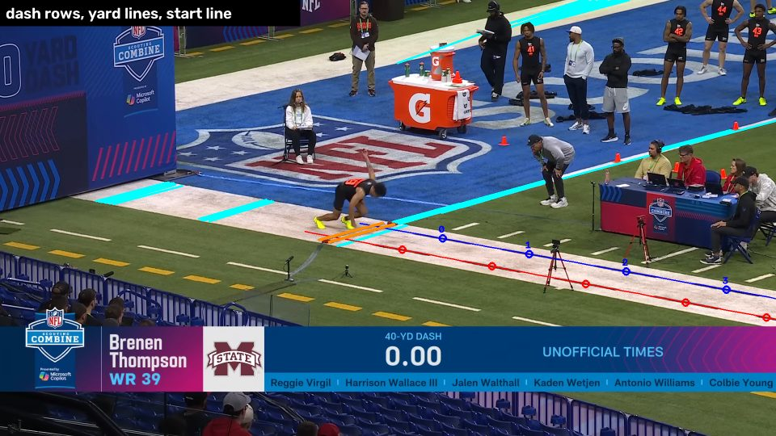

### 5. The runner's pose

- **Pose model.** YOLO11m-pose runs at 1280 px on every frame, on the Apple GPU.
- **Seeding.** The runner is the person set on the lane at the clock start.
- **Following.** The runner is followed by continuity of the hip and shoulder
  centres. The scale is normalised by the larger of torso length and box size,
  because the torso is foreshortened in the stance. People whose legs are off the
  lane, such as seated officials, are penalised.
- **Smoothing.** Keypoints below 0.3 confidence are masked, gaps of up to 4 frames
  are filled, and each coordinate is Savitzky–Golay smoothed.

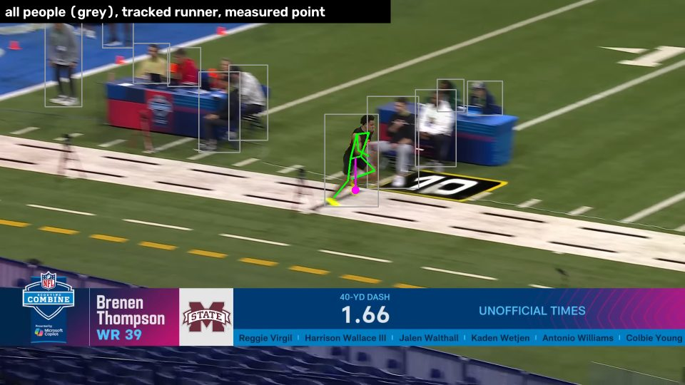

### 6. Position along the lane

The runner is measured against the dash marks visible in the same frame, so nothing
accumulates over the run (`src/yardage.py`).
1. **Same dash, same number.** Per-frame dash indices have an arbitrary offset.
   Offsets are chained on the rule that the camera moves less than half a period per
   frame. A second pass removes any slip, because the runner cannot move a whole
   period (~2 yd) in one frame.
2. **Across the lane.** The runner runs along the far row, whose map carries the
   measurement. The rung, the image of a line across the lane, takes its direction
   from the painted yard lines, which are found on ~96% of frames. That direction is
   fitted along the row, read at the runner, then smoothed over time. The rung ends
   on the near row's line.
3. **The measured point.** It is the ground point straight below the hip centre, on
   the runner's lateral line (the median across-lane position of the ankles). It
   follows the body's centre rather than the swinging feet.
4. **Zero** is the start line, measured where it crosses the far row.
5. **Cleaning.** Outliers more than 0.4 yd from a 7-frame rolling median are removed,
   and gaps of up to 4 frames are filled.

The yellow ticks below are every 5 yd across the lane, drawn from this geometry.
At the stop they sit on the painted 35 and 40 lines.

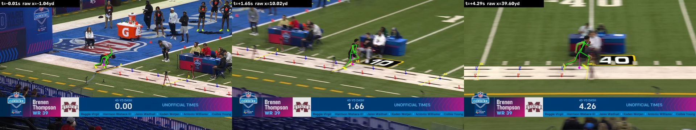

**Scale.** The dash spacing is the lane's own unit, and its length in yards comes
from the painted yard lines. These are 5 yd apart, with the start line on one of
them. `src/calibrate.py` places every yard line that crosses the far row and fits the
scale:
- over 56,756 crossings: 1.9680 yd (1.7996 m) per period;
- per video: 1.9658 to 1.9700 yd.

That's a 1.8 m layout, used exactly. The clock is never used for scale. The earlier
2.0 yd assumption put the 40-yd mark about 0.9 yd short at the finish (left panel).

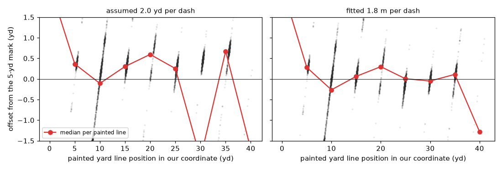

In the right panel, lines at 10, 20, 30 and 40 yd share their spot with the painted
distance mats and field numbers. Their white edges add false detections, which widen
the spread there.

### 7. Channels

From the tracked keypoints and the lane geometry (`src/features.py`):
- **Kinematics.** `x_yd` is smoothed over 9 frames. `v_yds` and `a_yds2` are 15- and
  21-frame Savitzky–Golay derivatives.
- **Angles** are measured in the image plane. "Forward" is the lane direction at the
  runner, and "vertical" is image-up.
- **Hip height** is measured to the ground point under the hip, divided by the
  run-median leg length.
- **Foot contact** uses raw ankle keypoints, because a contact lasts only ~3 frames.
  An ankle is planted when its speed along the lane is below 35% of body speed.
- **Steps** are touchdowns at a new place along the lane, which survives left/right
  swaps of the keypoints.

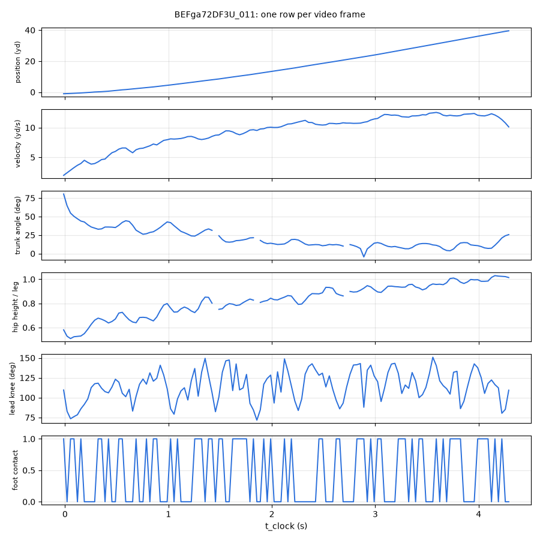

### 8. Quality control

A run is kept only if every rule holds (`src/qc.py`); `qc_reason` lists what failed.
The window checked is the dataset window.

| Check | Rule |
|---|---|
| Standard broadcast view | panel logo correlation ≥ 0.85 on every frame; no shot cut (colour histogram Bhattacharyya ≤ 0.35); turf covers ≥ 18% of every frame and ≥ 40% at the median |
| Clock | fit residual p95 ≤ 0.025 s; clock read on ≥ 60% of frames; bib agreement ≥ 80% |
| Measurement | lane on ≥ 90% and runner on ≥ 90% of frames; start line seen on ≥ 5 frames; no single-frame jump over 0.8 yd |
| Consistency | hip within 1.5 yd of 40 at the clock stop; hip between −2.2 and 0.1 yd at the clock start |
| Identity | panel position code matches the session group |
| Reported only | `yardline_resid`: median distance of the painted yard lines from our 5-yd marks |

| Rejection cause | Runs |
|---|---|
| Non-standard view (split screen, transition) | 28 |
| Clock stop disagrees with the measured distance | 13 |
| Clock residual | 4 |
| Runner or lane lost, jump, start out of range | 3 |

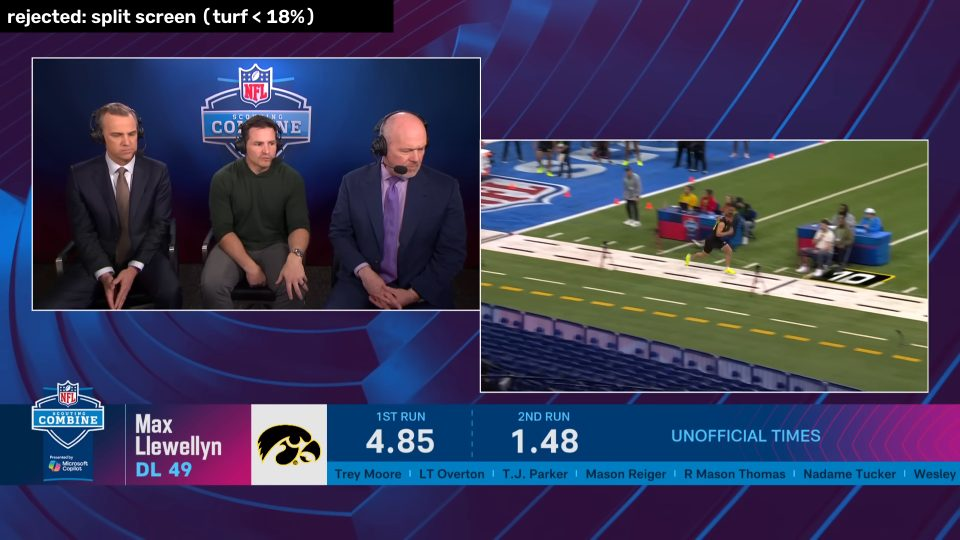

### 9. Result

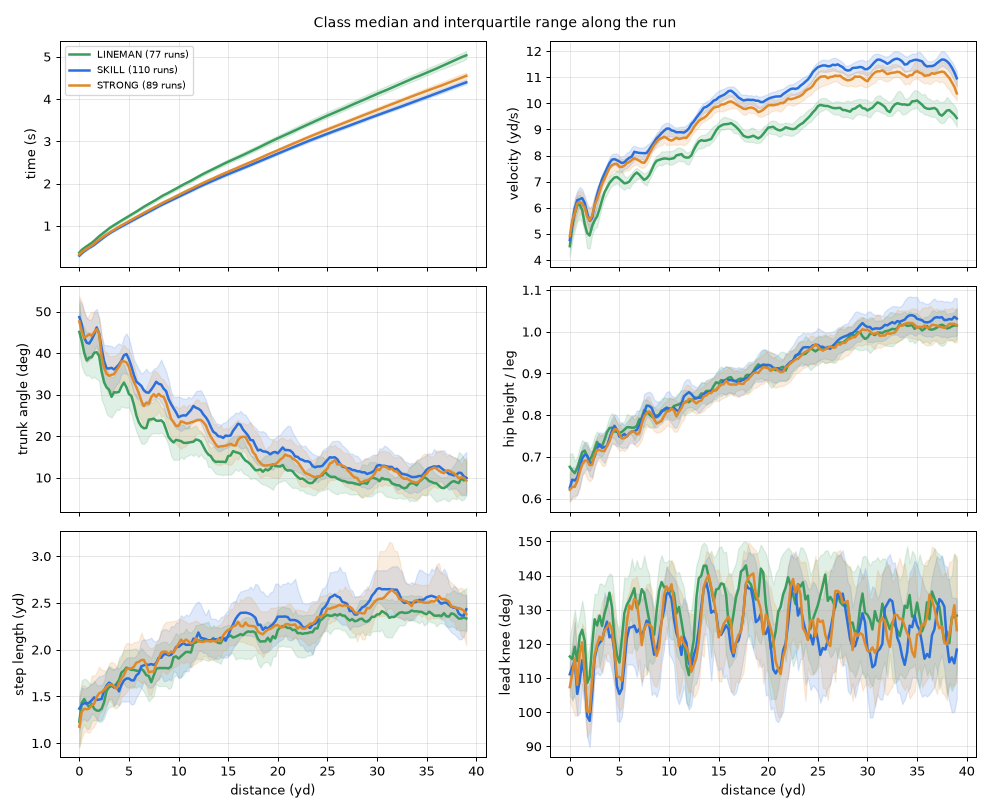

An offensive lineman's run, for comparison with the receiver at the top:

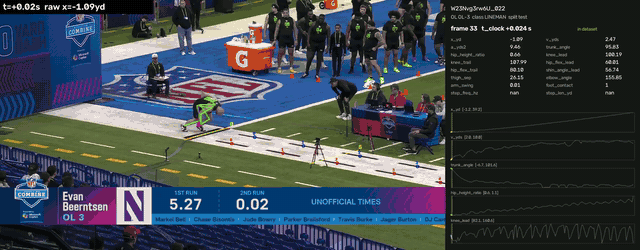

## Validation

- **Painted yard lines.**
  - Per run, the lines agree with our 5-yd marks to a median of 0.16 yd (p90 0.20).
  - The residual is flat along the run: medians at the 15, 25, 30 and 35 lines lie
    within ±0.1 yd.
  - A painted line that doesn't move measures with a per-frame sd of 0.10 yd
    (p90 0.13) as the camera pans. That is the positional noise floor.
- **Stop position.** The clock isn't used for scale.
  - At the clock stop the hip is at 39.60 ± 0.23 yd; each position lands between
    39.48 and 39.71.
  - This is expected: the timer stops when any part of the athlete breaks the beam,
    and the leading body parts are a few tenths of a yard ahead of the hip.
- **Held-out 10-yd split.** The panel split is never an input. Over 56 lineman runs
  the hip crosses 10 yd +0.126 ± 0.022 s after it. Leaning ~45° at that point, the
  head and shoulders break the beam well ahead of the hip.
- **Physics, from class medians.**
  - Top speed: SKILL 11.7 yd/s (10.7 m/s), STRONG 11.3, LINEMAN 10.1.
  - Trunk lean falls from ~39–45° at 1 yd to 10–13° at 30 yd.
  - Hip height rises from ~0.63 to ~1.02 of leg length.
- **Visual.** Contact sheets and annotated videos (`src/overlay.py`) were
  spot-checked on random kept runs and on every rejection category.
- **Signal.** Nearest-neighbour classification on the time grid, train → test
  (`src/baseline.py`; 3 classes, chance ≈ 0.33):

| Channels | 1-NN accuracy |
|---|---|
| progress (`t_clock`, `x_yd`) | 0.76 |
| velocity + acceleration | 0.70 |
| trunk angle + hip height | 0.55 |
| joint angles | 0.47 |
| stride (frequency, length) | 0.46 |
| all pose channels | 0.47 |

Speed and timing separate the classes most. Pose adds a weaker signal, but it is
well above chance. This is a sanity check, not a model.

## Reproducing the dataset

The published files are the reference. Rerunning needs the videos, and YouTube
can re-encode an upload: `download.py` reports whether a file differs from the one
recorded in `data/videos.csv`.

```bash
uv sync
uv run python src/download.py          # 1. videos at 1080p -> video/ (checksums checked)
uv run python src/panel.py templates   # 2. digit templates from the videos + committed labels
uv run python src/segment.py           # 3. clock scan, runs, frame-accurate clock -> data/runs_raw.csv
uv run python src/positions.py templates && uv run python src/positions.py   # 4. position codes
uv run python src/extract.py           # 5. pose + lane on every frame -> cache/frames/
uv run python src/build_db.py          # 6. tracking, yardage, channels, QC, split -> data/
uv run python src/calibrate.py         # 7. dash period from the painted yard lines
uv run python src/datapackage.py       # 8. data dictionary with checksums -> datapackage.json
uv run python src/baseline.py          # 9. nearest-neighbour sanity check
uv run python src/figures.py           #    README figures -> docs/img/
```

| Step | Time (Apple silicon) | Notes |
|---|---|---|
| `download.py` | network-bound (~3.5 GB) | retries alternate YouTube clients when one returns 403 |
| `panel.py templates` | ~1 min | deterministic harvest; the committed labels apply to it |
| `segment.py` | ~1 min per video | `--videos=id1,id2` to limit (ids starting with `-` need the `=` form) |
| `extract.py` | ~25 s per run, ~2.5 h for 326 | resumable; two workers on disjoint `--videos` halve it; `--lane-only --workers 6` redoes lane geometry on the cache (~20 min) |
| `build_db.py` | ~10 s | everything downstream of the cache |

To inspect any run:

```bash
uv run python src/overlay.py <run_id>                    # contact sheet -> frames/qc/<run_id>.jpg
uv run python src/overlay.py --video <run_id>            # annotated clip -> frames/qc/<run_id>.mp4
uv run python src/overlay.py --video --pad 0.5 <run_id>  # with context before the start and after the stop
```

The video shows the measurement on the broadcast:
- red and blue circles: the numbered dashes;
- yellow: the 5-yd ticks;
- green: the tracked skeleton;
- magenta: the measured point;
- right-hand panel: the frame's dataset row, with curves filling in as the run goes.

Videos, caches, renders and pose weights (`video/`, `cache/`, `frames/`, `models/`) stay
local and are gitignored.

## Limitations

- **Pose angles are image-plane angles.** The camera is oblique and pans along the
  run. The angles are comparable across runs, but they aren't true sagittal-plane
  joint angles.
- **Contacts and steps are coarse.** At 29.97 fps a ground contact spans ~3 frames,
  so `step_freq_hz` takes values of 30/n Hz (3.75, 4.29, 5.0, …).
- **`x_yd` is a mark count.** It is lane periods × 1.9685, zero at the start line.
  At the clock start the hip is at −1.21 ± 0.16 yd. That value depends on the
  runner's lateral line, which the oblique view at the start makes sensitive.
- **The clock is unofficial.** It is the broadcast's "unofficial times" graphic, so
  `time_40yd` isn't the official combine result.
- **Coverage is the broadcaster's.** Runs not shown, and runs rejected by QC, are
  missing. Position sample sizes are uneven (RB 15 to OL 56).

## Ethics and legal notes

*This is general information, not legal advice.*

- **Footage.** The broadcast footage belongs to the NFL and is not distributed here.
  The stills and GIFs above are reduced-resolution excerpts for research
  illustration, credited to the NFL.
- **Measurements.** The dataset contains measurements (positions, times, angles)
  taken from public broadcasts. In most jurisdictions, facts like these are not
  protected by copyright. The selection, processing and documentation are the
  author's and are licensed below.
- **Downloading.** Downloading from YouTube is governed by YouTube's Terms of Service.
  Anyone rerunning the pipeline is responsible for complying with them and with
  local law.
- **Athletes.** No names are stored, but the `athlete` key plus the public combine
  roster identifies them. The data describe public performances at a public event.
  Athletes who want their runs removed can open an issue, and they will be excluded
  from the next release.
- **Intended use.** Research and teaching on time-series classification and sprint
  mechanics. Not intended for scouting or judging individual athletes (see the
  [datasheet](DATASHEET.md)).

## Licence

- **Data** (`data/`): [CC BY 4.0](data/LICENSE). Reuse, including commercial reuse,
  is allowed with attribution. It covers the measurements, not the NFL footage.
- **Code** (`src/`, `notebooks/`): [MIT](LICENSE).
- **Pose model.** Ultralytics YOLO11 (AGPL-3.0) is a runtime dependency. It is not
  redistributed here.

## How to cite

Cite the dataset with its DOI, [10.5281/zenodo.22983135](https://doi.org/10.5281/zenodo.22983135).
That DOI covers all versions and resolves to the latest. For a specific version, use
its own DOI from Zenodo: 1.0.1 is
[10.5281/zenodo.22983136](https://doi.org/10.5281/zenodo.22983136). GitHub's *Cite this
repository* button produces APA and BibTeX from [`CITATION.cff`](CITATION.cff).

```bibtex
@dataset{cordeirosoares2026nfl40,
  author  = {Cordeiro Soares, Pedro Henrique},
  title   = {NFL Combine 40-Yard Dash Movement Time Series (2026)},
  year    = {2026},
  version = {1.0.1},
  doi     = {10.5281/zenodo.22983136},
  url     = {https://doi.org/10.5281/zenodo.22983136}
}
```

## Repository layout

| Path | Contents |
|---|---|
| `data/` | the dataset (CC BY 4.0), video registry, template labels |
| `datapackage.json` | data dictionary and checksums |
| `DATASHEET.md`, `CHANGELOG.md`, `CITATION.cff` | documentation, versions, citation |
| `notebooks/quickstart.ipynb` | Colab quick start |
| `docs/img/` | README figures |
| `src/download.py` | fetch and checksum the videos |
| `src/panel.py`, `src/segment.py`, `src/positions.py` | panel reading, run detection, position codes |
| `src/extract.py` | per-frame pose detections, lane geometry and QC signatures, cached |
| `src/lane.py`, `src/yardage.py` | lane geometry; runner tracking and position |
| `src/features.py`, `src/qc.py`, `src/build_db.py` | channels, quality control, dataset assembly |
| `src/calibrate.py`, `src/datapackage.py`, `src/baseline.py` | scale calibration, data dictionary, sanity check |
| `src/overlay.py`, `src/figures.py` | contact sheets, annotated videos, README figures |

## Maintenance and contact

Maintained by Pedro Henrique Cordeiro Soares
([ORCID 0009-0000-6041-2494](https://orcid.org/0009-0000-6041-2494)). Questions,
corrections and removal requests go through
[issues](https://github.com/phcs971/nfl-combine-40-timeseries/issues) or to
phcs.971@gmail.com. Versions are listed in the [changelog](CHANGELOG.md).
